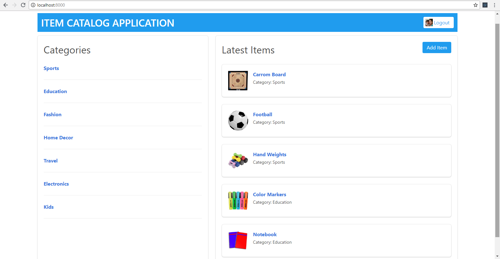

# Item Catalog Application

This project is a part of [Full Stack Web Developer Nanodegree Program](https://in.udacity.com/course/full-stack-web-developer-nanodegree--nd004). This is an application that provides a list of items within a variety of categories as well as provide a user registration and authentication system. Registered users will have the ability to post, edit and delete their own items.

## Table of contents

* [Objective of project](#objective-of-project)
* [Project files details](#project-files-details)
* [Project data structure](#project-data-structure)
* [Download and setup project](#download-and-setup-project)
* [How to run project](#how-to-run-project)
* [Demo of project](#demo-of-project)

## Objective of project

The objective of this project is to develop a RESTful web application using the Python framework Flask along with implementing third-party OAuth authentication.

## Project files details

This project includes files as follows,

* <span>application.py</span>
* database_setup.py
* <span>lotsofmenu.py</span>
* itemcatalog.db
* client_secrets.JSON
* fb_client_secrets.JSON
* <span>README.md</span>

Here, **<span>application.py</span>** includes main Flask application of the project.

**database_setup.py** includes database configuration code of database and mappers. It also includes classes for the database tables.

The file **<span>lotsofmenu.py</span>** includes data of the database which user can use to insert data manually by running this file.

**itemcatalog.db** file is the main database file.

The files **client_secrets.JSON** and **fb_client_secrets.JSON** include authentication data such as client ID and client secret.

The file **<span>README.md</span>** is a Markdown text file in which user describe the design of code and how to run it.

## Project data structure

This is the RESTful web application which based upon,

* [Python](https://www.python.org)
* [Flask (framework)](http://flask.pocoo.org)
* [SQLAlchemy (ORM)](http://www.sqlalchemy.org)
* [SQLite (database)](https://sqlite.org)
* [oauth2client](https://github.com/google/oauth2client)
* [BULMA (CSS framework)](https://bulma.io/)
* [jQuery](https://jquery.com/)

The application includes third-party authentication system like **Google** and **Facebook** to allow **CRUD** operations to the user.

The application also provides a JSON endpoint. To get response, follow the URL [http://localhost:8000/catalog.json](http://localhost:8000/catalog.json)

This application includes CURD operations for image handling and also includes CSRF protection on CRUD operations.

## Download and setup project

To run this project, a user needs to set up following things step by step...

* Install Vagrant and VirtualBox to run this project beacause, this project makes use of the Linux-based virtual machine (VM).
* Download the zip file of the project to your computer or user can clone the repository. [View project](https://github.com/bhumilakum/Item-Catalog-Application)
* Launch Virtual Machine inside the vagrant sub-directory using the following command into the command line.

```bash
vagrant up
```

* Use the following command to login into it.

```bash
vagrant ssh
```

## How to run project

First, the user needs to setup database using following command.

```bash
python database_setup.py
```

To populate the database with the table data, a user has to run following command.

```bash
python lotsofmenu.py
```

To run this project, a user should run the following command into the command line.

```bash
python  application.py
```

User can access and test an application by visiting [http://ec2-13-232-169-122.ap-south-1.compute.amazonaws.com/](http://ec2-13-232-169-122.ap-south-1.compute.amazonaws.com/) on browser.

## Demo of project


